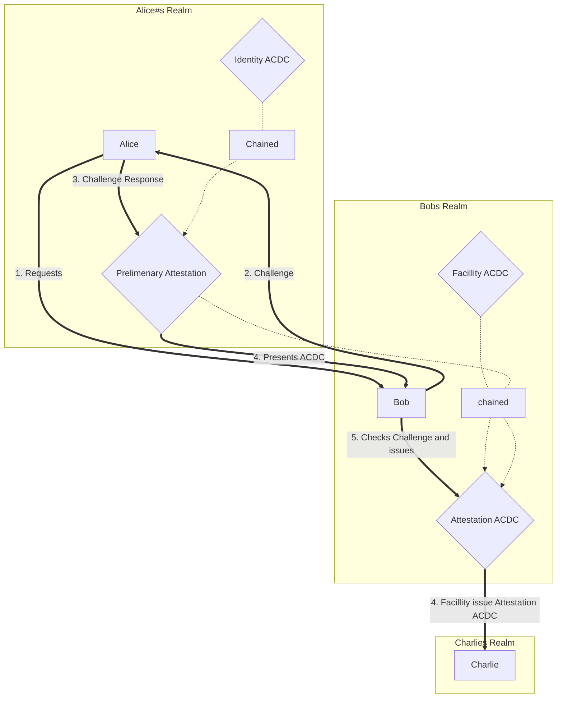
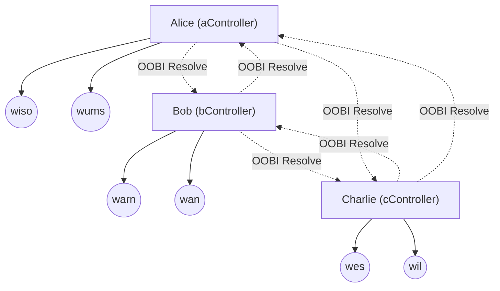

Keri Testing Script

# Prerequesites / Instruction on how to run
Inside the development container run the `workshop.sh` file.
If you are not using VSCode and DevContainer just use a normal docker container with keri and VLEI-server installed (look at .devcontainer/Dockerfile)


# Idea and Images
The idea is that Alice wants an Attestation from Bob to be recognized by Charlie.
After Bob has sent Alice a Challenge Alice issues itself an ACDC with the Challenge Response and presents that(Prelimenary Attestation PAC) to Bob.
Bob issues the Attestation to Charlie. 

For testing purposes the facility and identity ACDC's are copies of the Treasure Hunting Journey Credential from this tutorial: https://kentbull.com/2023/03/09/keri-tutorial-series-treasure-hunting-in-abydos-issuing-and-verifying-a-credential-acdc/





## Controller and Witness Setup with oobi resolves



# Error 
The problem ist that the ACDC creation of the Attestation ACDC with 2 edges to the facility ACDC and PrelimenaryAttestation ACDC just hangs with: 
```
Waiting for TEL event witness receipts
Sending TEL events to witnesses
```
